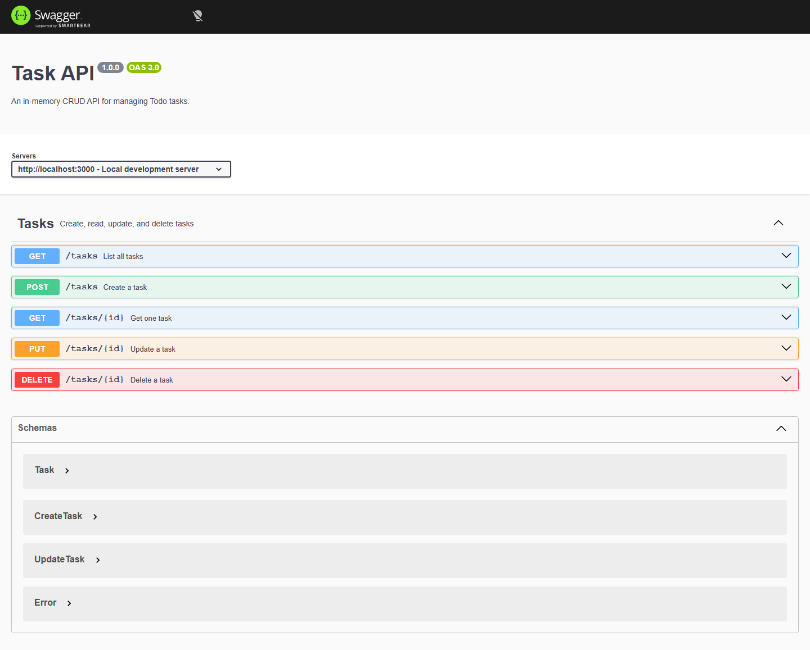

# Task API

An in-memory Todo CRUD API built with Node.js, Express, and TypeScript.

This project was built incrementally as part of the CRUD API assignment. It demonstrates the four core data operations:

- Create a task
- Read one or more tasks
- Update a task
- Delete a task

## Requirements

- Node.js 20.6 or newer
- npm

## Install and run

```bash
npm install
npm run dev
```

The API starts at:

```text
http://localhost:3000
```

The production-style build commands are:

```bash
npm run build
npm start
```

## Swagger UI

Interactive API documentation is available at:

```text
http://localhost:3000/docs/
```

Open an endpoint, select **Try it out**, provide any required values, and select **Execute** to send a real request.



## Assignment endpoints

| Method | Endpoint | Description | Success status |
| --- | --- | --- | --- |
| GET | `/` | Describe the API | 200 |
| GET | `/health` | Check whether the server is running | 200 |
| GET | `/tasks` | List all tasks | 200 |
| GET | `/tasks/:id` | Get one task | 200 |
| POST | `/tasks` | Create a task | 201 |
| PUT | `/tasks/:id` | Update a task title and/or completion state | 200 |
| DELETE | `/tasks/:id` | Delete a task | 204 |

The API returns `400` for invalid request bodies and `404` when a task ID does not exist.

## Example requests

List tasks:

```bash
curl -i http://localhost:3000/tasks
```

Create a task:

```bash
curl -i -X POST http://localhost:3000/tasks \
  -H "Content-Type: application/json" \
  -d '{"title":"Buy milk"}'
```

Example response:

```text
HTTP/1.1 201 Created
Content-Type: application/json; charset=utf-8
```

```json
{
  "id": 4,
  "title": "Buy milk",
  "done": false
}
```

Update a task:

```bash
curl -i -X PUT http://localhost:3000/tasks/4 \
  -H "Content-Type: application/json" \
  -d '{"done":true}'
```

Delete a task:

```bash
curl -i -X DELETE http://localhost:3000/tasks/4
```

An existing task is deleted with status `204 No Content` and an empty response body.

## Task shape

The assignment-compatible endpoints return tasks in this form:

```json
{
  "id": 1,
  "title": "Learn APIs",
  "done": false
}
```

The versioned production API is also available under `/api/v1/tasks`. It uses UUID IDs and includes descriptions and timestamps.

## Important limitation

Tasks are stored in memory only. Restarting the server resets the data to the three seeded example tasks. No database or files are used yet; persistent storage is planned for a later stage.

## Development commands

```bash
npm run dev        # Run TypeScript with automatic restart
npm run typecheck  # Check TypeScript without emitting files
npm run build      # Compile TypeScript to dist/
npm start          # Run the compiled production build
```

## Project structure

```text
src/
├── app.ts                 # Express application and middleware
├── server.ts              # Server startup and port configuration
├── config/env.ts          # Environment configuration
├── data/task-store.ts     # In-memory task data
├── docs/openapi.ts        # OpenAPI/Swagger document
├── routes/                # HTTP routes and validation
├── services/              # Task business logic
└── types/                 # TypeScript models
```

## License

ISC
